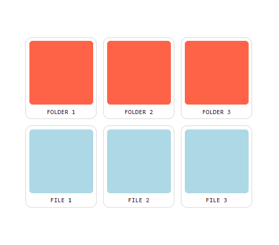

# Sort and Drop



## Description
"Sort and Drop" is a small project to made a light class for making sortable list with sortable, droppable, selectable items, compatible in desktop and mobile (toushcreen), made in pure Javascript.

## Getting Started
Simply import the class into your project :
```js
import { SortAndDrop } from "sort_and_drop.js";
```
## Usage
```html
<body>
  <div class="items">
      <div class="folder item">
          <div class="image"></div>
          <div class="title">FOLDER 1</div>
      </div>
      <div class="folder item">
          <div class="image"></div>
          <div class="title">FOLDER 2</div>
      </div>
      <div class="folder item">
          <div class="image"></div>
          <div class="title">FOLDER 3</div>
      </div>
      <div class="file item">
          <div class="image"></div>
          <div class="title">FILE 1</div>
      </div>
      <div class="file item">
          <div class="image"></div>
          <div class="title">FILE 2</div>
      </div>
      <div class="file item">
          <div class="image"></div>
          <div class="title">FILE 3</div>
      </div>
  </div>
</body>
```
```js
const el = document.querySelector(".items");
const options = {
  droppable:".folder",
  selectArea:"body"
}
new SortAndDrop(el, options);
```
In this case, it will result on a list of folders and files sortable and selectable into the "<body>" element. The elements ".folder" accept the others elements to be dropped into it.
### Options
```js
const sortable = new SortAndDrop(el, {
    // Query of elements who accept a drop of other elements
    droppable:'.folder',

    // Default "row". Can be "column" or "row". The direction of the list
    direction:"row",

    // Query of elements who can be placed into the list from an other
    accept:".folder, .file",

    // Query of parent element who is use to trigger the selectable rectangle
    selectArea:"body",

    // Function to be executed when a sortable is made
    onSort:function(evt) {
      evt.cursorX; // Position X of the cursor
      evt.cursorY; // Position Y of the cursor
      evt.downLeft; // Left position of the cursor when has down
      evt.downTop; // Top position of the cursor when has down
      evt.downTimestamp; // Timestamp of the mousedown event trigger
      evt.drop; // True or false, define if it's an drop event
      evt.relatedElement; // The element who have been draged
      evt.relatedRect; // The rectangle of the relatedElement
      evt.scrollableElement; // The parent element who is scrollable
      evt.selectableArea; // The HTMLnode element who is the area for trigger the selecting mode
      evt.selected; // Nodelist of elements who are selected
      evt.sort; // Can be 1, -1 or null. It representing the direction of the sorting relative to the evt.targetElement. For drop, the value is null
      evt.targetElement; // The element used for the dropping or sorting
      evt.targetRect; // The rectangle of the relatedElement
      evt.to; // The instance of SortAndDrop concerned (for multiple lists)
    },

    // Function to be executed when a droppable is made
    onDrop:function(evt) {
      // evt is the same as onSort
    }
});
```
### Style
The class add four classes :
```css
/* Added to the item behind the gragged item if it accept drop */
.sad-highlight {}

/* Added to all elements selected */
.sad-selected {}

/* The class for the placeholder when dragging an element */
.sad-placeholder {}

/* The class of the selectable rectangle */
.sad-select-placeholder {}
```
No default style is provided. So, be sure to add it by your self !
### Debug mode
The class have a debug mode to see what's happening in real time. To enable it, set the "debug" property to true :
```js
SortAndDrop.debug = true;
```
That's it ! Now, when you drag an element, you can see what is happening :

